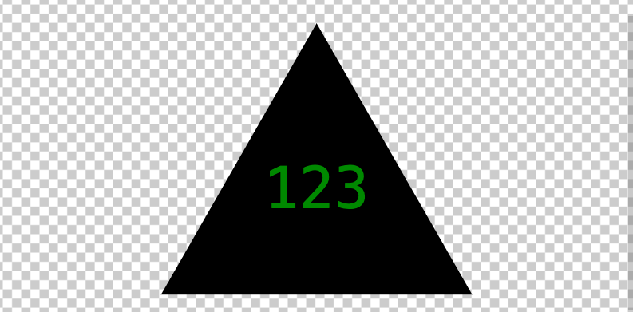

# LEISURELY-LOGOS

A SVG logo generator powered by:

- node.js
- inquirer
- jest

[This is an external link to the 'Leisurely Logos' repository](https://github.com/rhodemc/leisurely-logos)

## Description

I was motivated to create a logo generator because it is an efficient way to make a quick company logo without distracting from the coding work, itself.

When using this logo generator, you'll find responsive prompts that create a brilliant logo in SVG file format.

## Installation

Once the repository is downloaded, please navigate to the correct file path in your command terminal and enter 'npm i' to install the necessary dependencies.

## Usage and Testing

Once necessary dependencies are installed, run 'node index' in your command terminal to begin the logo generation.

Run 'npm run test' to run Jest through the test suite.

Future updates will include more shape options.

[This is an external link to the 'Leisurely Logos' usage video](https://drive.google.com/file/d/1BMRoMUcqi0YldOc2OhVO4Vty_Bl5a5sN/view)

## Credits

N/A

## License

This project is licensed by MIT. Please refer to the documentation in the repo.
